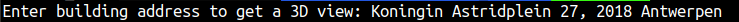
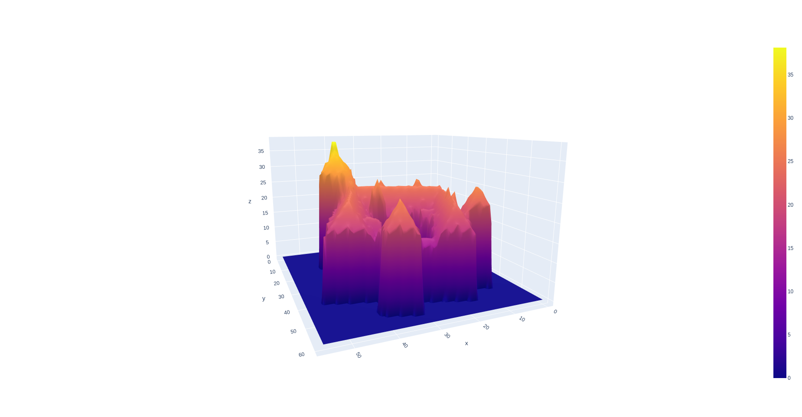

# 3D View of the House

This project will create the 3D view of the building present in Flanders region of Belgium with the help of building address.


## Prerequisite to run the project

Python 3 should be install in you system.
To install python you can follow the link [Install Python](https://realpython.com/installing-python/#how-to-install-python-on-macos)
To run this project we need some libraries. You can find the details in [requirements.txt](requirements.txt)

## How to run the project?

To run this project execute below commands

`git clone https://github.com/reenakoshta10/3D_houses.git`

`cd 3D_houses`

If default python version is python3 on your local then run below command -

`python 3D_house.py`

otherwise run this command -

`python3 3D_house.py`

## What should you do project execution started?

- Enter the address of the building



## Project Result



## Repo Architecture 

```
3D_houses
│
│   README.md           :explains the project
│   raster_file_list.csv   :keeps all data for properties
│   3D_house.py   :main python file for execution 
│   3D_house.ipynb   :main python file for execution in jupyter-notebook
│   requirements.txt   :contains list of python libraries required to run the project
│__   
│   utils              :contails utilility files
│   │
│   │ get_file_list.py      :This file can help to get bound information for all the raster file and create csv file.
│   │ get_file_list.ipynb      :This file can help to get bound information for all the raster file and create csv file in jupyter-notebook.
│   │ imgs      :contains images for README file
│   

```

## Project workflow

Project work in below steps:
- Enter address
- Based on address it find the location coordinates and polygon coordinates from the api
- With polygon coordinates it create shape file
- find the DSM (Digital Surface Map) and DTM (Digital Terrain Map) file path with the help of raster_file_list.csv and location coordinate it find and download the raster file from the below links
    * [DSM](http://www.geopunt.be/download?container=dhm-vlaanderen-ii-dsm-raster-1m&title=Digitaal%20Hoogtemodel%20Vlaanderen%20II,%20DSM,%20raster,%201m)
    * [DTM](http://www.geopunt.be/download?container=dhm-vlaanderen-ii-dtm-raster-1m&title=Digitaal%20Hoogtemodel%20Vlaanderen%20II,%20DTM,%20raster,%201m)
- create the geotiff file with polygon and raster and crop based on the polygon coordinates
- create Canopy Height Model(CHM) from the DSM and DTM raster files
- Using the CHM data array plot the graph.

## Contact

Created by [Reena Koshta](https://github.com/reenakoshta10) - feel free to contact me!

## Have a nice day!
